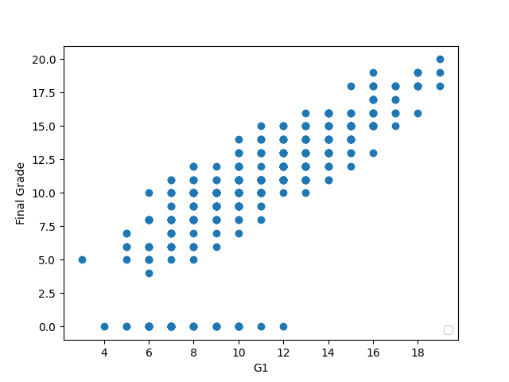
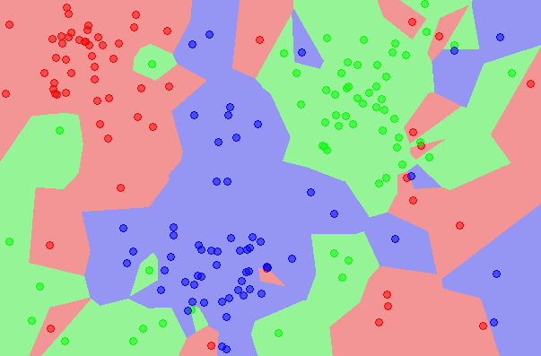
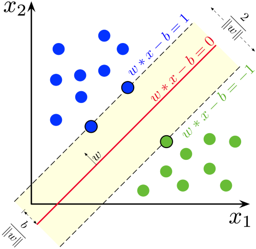

# Python-Machine-Learning

This repository will house some common machine learning algorithms 
in Python in order to better understand machine learning and data science,
as well as to better use Python's strong libraries and resources.

### [LinearRegression](https://github.com/elsowiny/Python-Machine-Learning/tree/main/linearRegression)

### [K-Nearest Neighbors](https://github.com/elsowiny/Python-Machine-Learning/tree/main/KNN)

### [Support Vector Machine](https://github.com/elsowiny/Python-Machine-Learning/tree/main/SVM)
