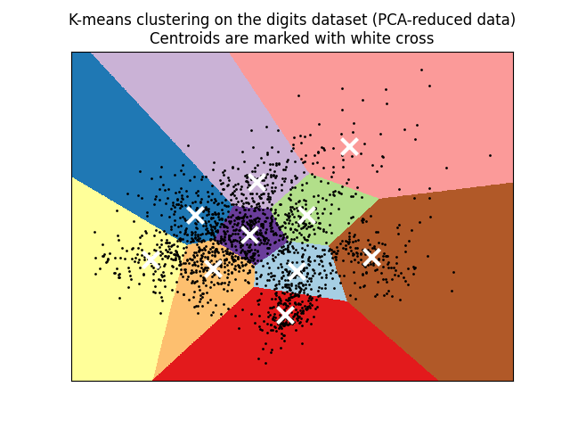

# Linear Regression
#### [Python Machine Learning Repo](https://github.com/elsowiny/Python-Machine-Learning)

### Objective: To classify hand written digits using K means clustering
This project utilises well known libraries available in the Python language for data manipulation, and data science. In this project, I explore using these tools and explore machine learning in Python. The project consists of downloading a large data set of student performance. Using Python, and specific libraries such as pandas and numpy, we are able to perform linear regression on our data in order to predict students final grades based on a series of attributes.

### The Data: SKLEARN data

## K MEANS CLUSTERING

